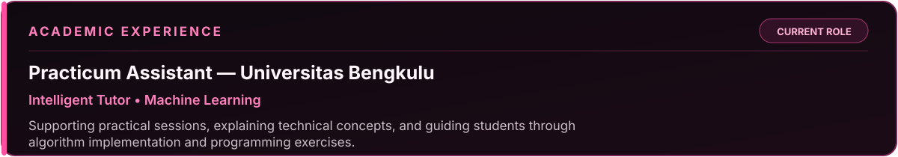
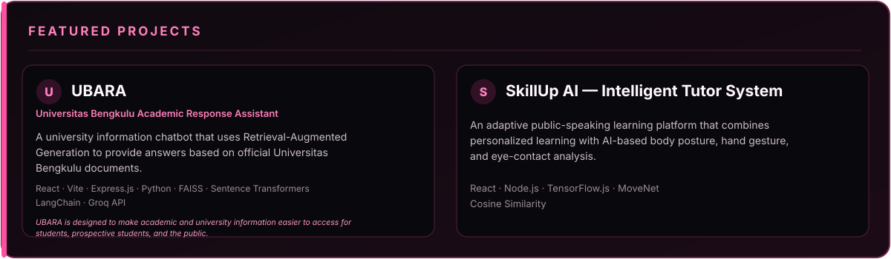
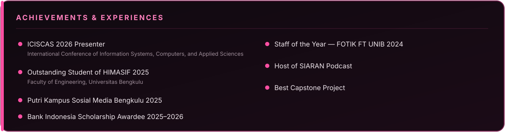
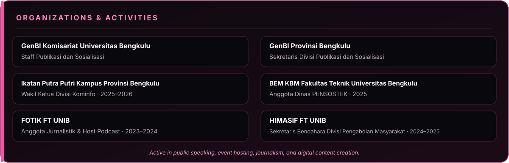

# Hi, I'm Sendy Gyta Klaudya! 👋

<h2 align="center">About Me</h2>

I'm an Information Systems student at **Universitas Bengkulu** who enjoys combining technology, communication, and social impact. I am particularly interested in **Artificial Intelligence, Retrieval-Augmented Generation (RAG), web development, and digital innovation**.

- 🎓 Information Systems student at Universitas Bengkulu
- 👩‍🏫 Practicum Assistant for **Intelligent Tutor** and **Machine Learning**
- 🤖 Currently developing **UBARA**, a RAG-based university information chatbot
- 🌱 Exploring AI, NLP, machine learning, and full-stack development
- 🎤 Experienced as a master of ceremonies, podcast host, and public speaker
- 💡 Interested in building useful technology with real-world impact
- 🤝 Open to collaboration on AI, education, and social-impact projects

 

<h2 align="center">Tech Stack</h2>

<h3 align="center">Languages</h3>

<h3 align="center">Frameworks & Tools</h3>

<h3 align="center">AI & Data</h3>

 

<h2 align="center">🐍 The Serpent's Path — Contributions</h2>

<em>Watch the pink serpent devour my contribution fields.</em>

<picture>
  <source media="(prefers-color-scheme: dark)" srcset="https://raw.githubusercontent.com/Sendygk/Sendygk/output/github-contribution-grid-snake-dark.svg">
  <source media="(prefers-color-scheme: light)" srcset="https://raw.githubusercontent.com/Sendygk/Sendygk/output/github-contribution-grid-snake.svg">
  
</picture>

<h2 align="center">🛠️ Forge an Alliance</h2>

<em>Every great journey needs allies. Let's connect and create something meaningful.</em>

---

### “Learn, create, and make an impact.” 🌸

